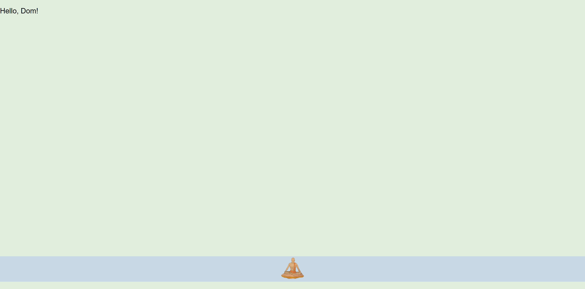

# html-css-ts-project-template

## Assignment

The goal of this assignment was to create a basic webpage to act as a template for all future html projects.

The above is a screen capture of the template that I created.

A link to the webpage that I made can be found in the About section of this repository or below.

https://html-css-template-dommitchell.netlify.app/
